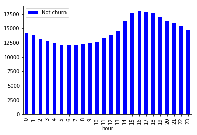

# Sparkify project

This is udacity's capstone project, using spark to analyze user behavior data from music app Sparkify. I post a blog about this, you can find it [here](https://medium.com/@fxzero/some-tips-of-using-spark-to-predict-user-churn-eb7e5846b0c5).

### Project Overview

Sparkify is a music app, this dataset contains two months of sparkify user behavior log. The log contains some basic information about the user as well as information about a single action. A user can contain many entries. In the data, a part of the user is churned, through the cancellation of the account behavior can be distinguished.

### Problem Statement

The job of the project is to find the characteristics of churned users from the behavioral data of these users, and take measures to retain the potential lost users as early as possible.

The difficulty of the project is that the data handed to the model training should be one item for each person. While our data are behavioral data, we need to extract the user characteristics from the behavioral data, and then hand it to the model for training and get the results. These features will be generated from exploratory data analysis and feature engineering. In the case of poor results, the process may iterate many times until the model performs well.


### Data Preprocessing

Behavioral data is different from the final training data, and we need to clean up some values that are not in our consideration. UserId and sessionId are keywords whose behavior is difficult to analyze if they are null, so the null value need to be removed.

There are some empty strings in the userId that may be actions of unregistered users from their browsing pages. These users are not related to this churn rate analysis, so they are also removed from the data set.


### Exploratory Data Analysis

First I've sorted out the meaning of all the columns

> Artist:  Composer
>
> Auth: login status
>
> firstName: first name
>
> gender: gender
>
> ItemInSession: operation sequence number of this session, from small to large according to time
>
> lastName: surname
>
> length: the length of the song
>
> Level: whether the user is paid
>
> location: the user location
>
> method: method of getting web pages (put/get)
>
> page: browse the page overview
>
> registration: time stamp for registration point in time
>
> sessionId: sessionId that should be used to determine a single login operation
>
> song: song name
>
> status: page return code (200/307/404)
>
> ts: the timestamp of the log time
>
> UserAgent: browse the client information
>
> UserId: userId


I looked at all the page values, which recorded all the possible actions of the user. One things to confirm is Cancellation Confirmation, it means the churn users. And most of the rest of the operations are in the process of listening to the music. Downgrade related activities should also be very important for companies, but this Downgrade is not in our research range.

```
+--------------------+
|                page|
+--------------------+
|              Cancel|
|    Submit Downgrade|
|         Thumbs Down|
|                Home|
|           Downgrade|
|         Roll Advert|
|              Logout|
|       Save Settings|
|Cancellation Conf...|
|               About|
|            Settings|
|     Add to Playlist|
|          Add Friend|
|            NextSong|
|           Thumbs Up|
|                Help|
|             Upgrade|
|               Error|
|      Submit Upgrade|
+--------------------+
```

I first converted the timestamp to standard time for my observation and analysis. At the same time, all data periods were observed between October 1, 2018 and December 1, 2018.

```
+-------+-------------------+
|summary|               time|
+-------+-------------------+
|    min|2018-10-01 00:00:11|
|    max|2018-12-01 00:01:06|
+-------+-------------------+
```

I looked at the records of some of churn users. Free users often receive a Roll Advert, which can have an impact on the user. Downgrade pages are sent to subscribers regularly, which may also have an impact. However, a similar situation can be found when looking at non-lost user records, so the impact cannot be determined.

I then added the churn column to the dataset to mark churn users, so now I can observe the difference between what happens to churn users and what doesn't.

The ratio of males to females is slightly different.


looking at the paid status of the churn users, it seems that the paid users account for a large proportion, and then we can add this feature to see if it helps the model.


This is the frequency of each page, I used the number of operations per 100 to analyze. You can see that the churn users Roll Advert frequency was significantly higher than the non-churn users. In addition, the two operations of Cancel and Cancel Confirmation are used to distinguish the churn users, so these two data cannot be analyzed by the user model and need to be removed before training the model.


The number of operations per session doesn't seem to make much difference between the two groups.


Finally, I checked the distribution of the two groups according to the time points of listening to the music. There were slight differences between the time and the week, and significant differences between the time points of the month. The difference in monthly time points may be due to the uniform distribution of user churn, resulting in fewer users at the end of the month.




### Feature Engineering

The selection of features is based in part on user characteristics, including gender, registration time, whether paid, and how many singers have been heard.


Some are based on behavioral data. The selection of behavioral data is mostly based on the session of each user, including the statistical value of listening time of each session, the number of listening songs in each session, and the number of sessions.


The final count is the number of pages per 100 views.I generated a dataframe for each feature separately, and finally made all features into a dataframe for the final training model by left linking.


### Modeling

First, I confirmed the skew of data distribution.Data skew affects not only our metrics, but also our results, as we'll see later.

```
+-----+-----+
|churn|count|
+-----+-----+
|    1|   99|
|    0|  349|
+-----+-----+
```

Then I saved the data. In the process of my many times of training, I thought that after restarting the kernel and re-reading the data, the speed of training would be significantly faster.


Before spark training the model, it was necessary to put all the features into vectors. When putting data into vectors, I found that many of my features were string types, so I have to convert them to float.


Although it does not affect the tree model, standardization is important for linear models. I decided to standardize the data.


I use linear model and tree model for training, including logistic model, decision tree and GBT. I select the model with the best performance, divide the test set using 3-fold cross validation and grid search to determine the model parameters for the training set. Finally I use the validation set to evaluate the model performance. Due to the imbalance of categories, F1 is used as the measurement standard for training and evaluation.


The result is not ideal, the recall rate of the model is very low, even the recall rate of the tree model is 0. I decided to undersample the training data, balance the categories of the training set to increase the recall rate and improve f1.


There is a strange problem here. Training results through cross-validation is good, but testing with validation sets is very poor. Logistic regression for example, the training result F1 score is 0.75, and the test result F1 score is 0.4. After the use of undersampling, the training result drops to 0.67, and the test result is 0.55.

```
F1 result:
Training: 0.758073899263998
Testing: 0.4

Training with undersample: 0.6696185966538797
Testing with undersample: 0.5517241379310345
```


The best model is logistic regression. According to the results of the model, it is the frequency of Thumbs Down that has the greatest impact. Churn users have more Thumbs Down. Naturally, users will leave if they are not satisfied.

Besides, the frequency of downgrade pages is also a big factor. I think this is because users hate the downgrade prompt. Registration time is also a factor, the longer the registration time users will not leave.

| Factor              | Coefficient |
| ------------------- | ----------- |
| regDay              | -0.3309     |
| avgSessionTime      | 0.0733      |
| minSessionTime      | 0.0879      |
| maxSessionTime      | 0.0051      |
| avgSessionSongs     | 0.1531      |
| sessionCount        | -0.0413     |
| gender              | 0.0551      |
| level               | 0.33        |
| freqSubmitDowngrade | -0.047      |
| freqThumbsDown      | 0.6621      |
| freqHome            | -0.0263     |
| freqDowngrade       | 0.4479      |
| freqRollAdvert      | 0.1244      |
| freqLogout          | -0.2142     |
| freqSaveSettings    | -0.1489     |
| freqAbout           | -0.3724     |
| freqSettings        | -0.0263     |
| freqAddtoPlaylist   | -0.0841     |
| freqAddFriend       | 0.0727      |
| freqNextSong        | -0.5653     |
| freqThumbsUp        | -0.2821     |
| freqHelp            | 0.1021      |
| freqUpgrade         | 0.1177      |
| freqError           | -0.1501     |
| freqSubmitUpgrade   | 0.1545      |
| aritstCount         | -0.0993     |


